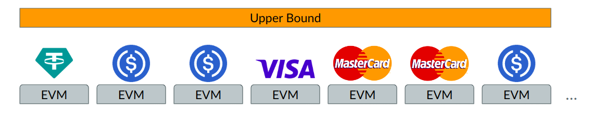
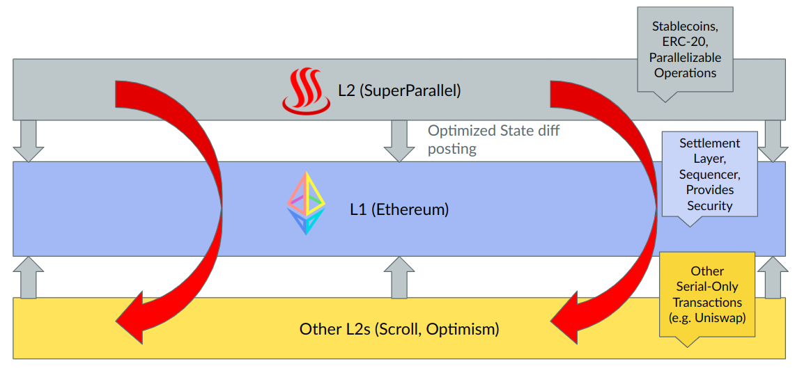
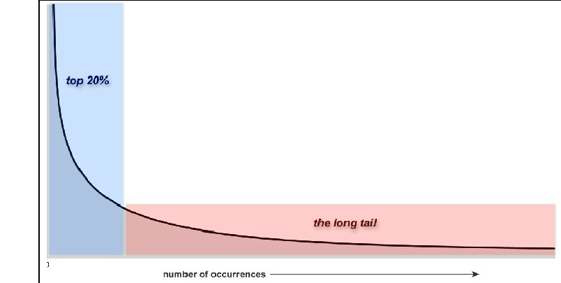
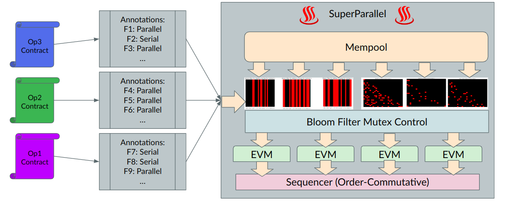

# ♨️ SuperParallel

♨️ Highest Throughput EVM L2 PoC, designed for payments ♨️

## Summary

Introducing: **SuperParallel!** highest throughput EVM L2 designed for payments.

Parallelizable Contracts only in this L2! And interoperate with ETH and ETH ecosystem.
- Highest possible throughput for power law application: Transfer of wealth
- Inherit Decentralization + Security Properties of Ethereum
- Interoperable with wider Ethereum + Rollup Ecosystems
- No MEV (No frontruns)

Basic Idea:

Ethereum Ecosystem Interoperability:

## Problem

Micropayments are the future. Micropayments revolutionize digital content consumption and monetization, fostering innovation, inclusivity, and efficiency in the digital economy. By seamlessly integrating with cutting-edge technologies like blockchain, they provide a secure and transparent platform for transactions, encouraging a more dynamic digital ecosystem.

- Enhanced Access and Monetization: Micropayments enable flexible, pay-as-you-go access to digital content, benefiting both consumers and creators.
- Innovation and Competition: They open avenues for novel business models and creative ventures, boosting market diversity and quality.
- Technology Synergy: The integration with blockchain technology ensures secure, efficient, and low-cost transactions, facilitating wider adoption and trust.

> Bitcoin tried to become the de-facto medium for transfer of value. It failed due to its low throughput and high fees.

Stablecoins such as USDC emerged as dominant players, yet they face challenges with high transaction fees that hinder global adoption. Additionally, other "high throughput" blockchain networks encounter issues related to security, decentralization, scalability, and EVM compatibility. Despite these challenges, payments remain a robust and power law application of cryptocurrency with proven product-market fit, exemplified by Circle's approach to an IPO, as reported by [Reuters](https://www.reuters.com/markets/deals/stablecoin-firm-circle-confidentially-files-us-ipo-2024-01-11/).

## Implementation

Static Annotation of solidity smart contracts + Bloom Filter Mutex control to ensure parallelizability. 

Can read more about the implementation at: [Slides](https://docs.google.com/presentation/d/1QMw9t38TNsDCZesRFK90rzCWjB6m-wrVypBqQu_uOhk/edit?usp=sharing)