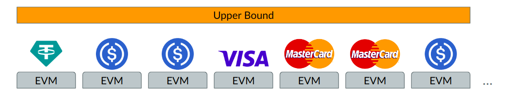
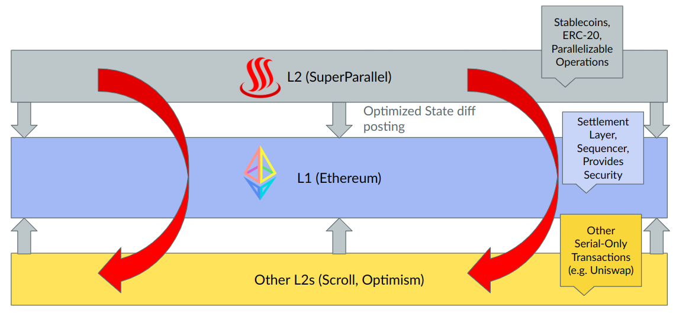
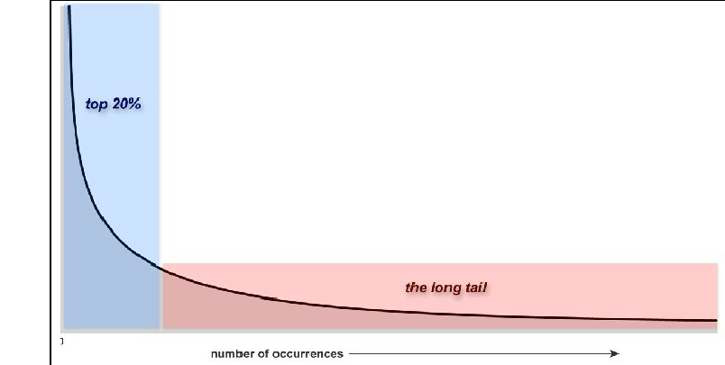
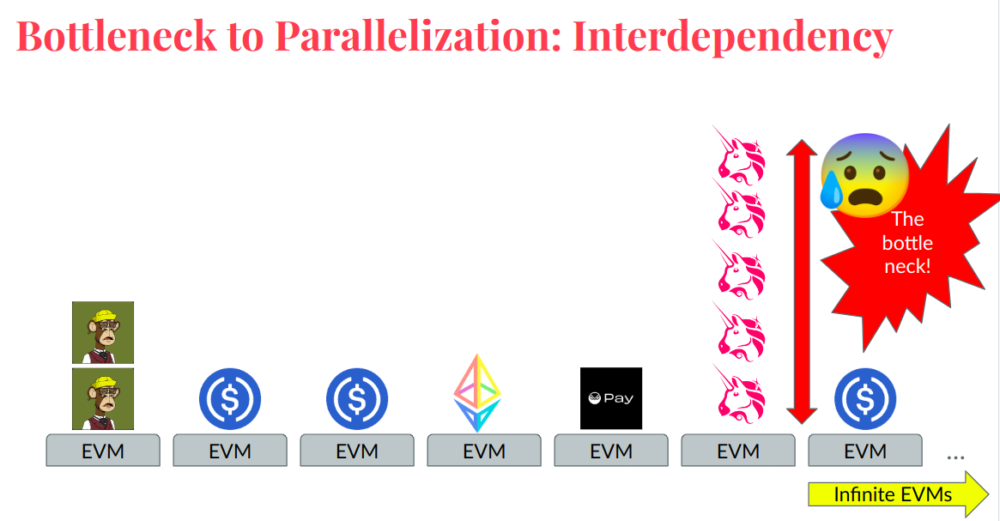
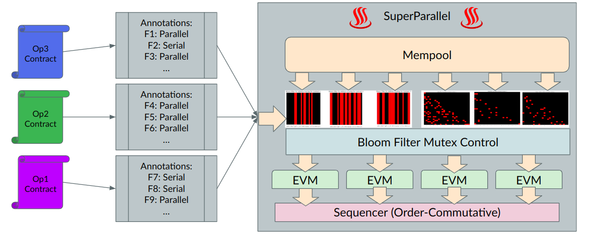

# ♨️ SuperParallel

♨️ Highest Throughput EVM L2 PoC, designed for payments ♨️

Follow [Sentou Tech](https://x.com/sentoutech) for updates on the project. 

## Table of Contents

- [Summary](#summary)
- [Problem](#problem)
- [Implementation](#implementation)
- [Limitations](#limitations)

## Summary

Introducing: **SuperParallel!** highest throughput EVM L2 designed for payments.

Parallelizable Contracts only in this L2! And interoperate with ETH and ETH ecosystem.
- Highest possible throughput for power law application: Transfer of wealth
- Inherit Decentralization + Security Properties of Ethereum
- Interoperable with wider Ethereum + Rollup Ecosystems
- No MEV (No frontruns, since the operations are commutative by design)

Basic Idea:

Ethereum Ecosystem Interoperability:

## Problem

Micropayments are the future. Micropayments revolutionize digital content consumption and monetization, fostering innovation, inclusivity, and efficiency in the digital economy. By seamlessly integrating with cutting-edge technologies like blockchain, they provide a secure and transparent platform for transactions, encouraging a more dynamic digital ecosystem.

- Enhanced Access and Monetization: Micropayments enable flexible, pay-as-you-go access to digital content, benefiting both consumers and creators.
- Innovation and Competition: They open avenues for novel business models and creative ventures, boosting market diversity and quality.
- Technology Synergy: The integration with blockchain technology ensures secure, efficient, and low-cost transactions, facilitating wider adoption and trust.

> Bitcoin tried to become the de-facto medium for transfer of value. It failed due to its low throughput and high fees.

Stablecoins such as USDC emerged as dominant players, yet they face challenges with high transaction fees that hinder global adoption. Additionally, other "high throughput" blockchain networks encounter issues related to security, decentralization, scalability, and EVM compatibility. Despite these challenges, payments remain a robust and power law application of cryptocurrency with proven product-market fit, exemplified by Circle's approach to an IPO, as reported by [Reuters](https://www.reuters.com/markets/deals/stablecoin-firm-circle-confidentially-files-us-ipo-2024-01-11/).

A popular narrative in Q1 2024, is the notion of parallel-EVMs (e.g. Monad, Sei, NeonEVM), which broadly "solves" all of the aforementioned problems - except they have one problem: Suppose you have infinite number of parallel EVMs that you can parallel-execute the transactions over. Then what is the upper bound on the time complexity of blockchains? Answer: Longest Chain of Interdependent Transactions (e.g. Sequence of uniswap transactions in a given block)

## Implementation

TLDR: Static Annotation of solidity smart contracts + Bloom Filter Mutex control to ensure parallelizability. 

The project uses [evmone](https://github.com/ethereum/evmone) (C++ EVM, lowest latency EVM in the world) as the EVM execution engine. 

Prior to execution, there is an "annotation" of the contract ABI for the contracts which uses a python script. This selects which functions are parallelizable or serial. For each contract also, there is a bloom filter created alongside state, which tracks the mutex ownership in a given block. 

Then, at runtime, we simulate the mempool with a python script which tests if the given transaction can be state-accessed, by running a lookup on the bloom filter to see if the mutex is currently in lock. If it is in lock, it will reject the transaction, if not, it will update the bloom filter and acquire the mutex, and allocate execution of the transaction in parallel to evmone. 

The entire mutex for each storage slot is released upon completion of the block.

Can read more about the implementation at: [Slides](https://docs.google.com/presentation/d/1QMw9t38TNsDCZesRFK90rzCWjB6m-wrVypBqQu_uOhk/edit?usp=sharing)

Follow ♨️ [Sentou Tech](https://x.com/sentoutech) for updates on the project. 

## Limitations

- No complex contract-contract call cases implemented
- Database structure is not implemented
- Does not support parallelization from bytecode directly
- More targeted bloom filter mutex lock operation in `superparallel.py` in step 1. (+ Advanced annotation to see which states are being locked, in which direction of the operation)

## ETHGlobal London Prizes

### Circle

### WorldCoin
